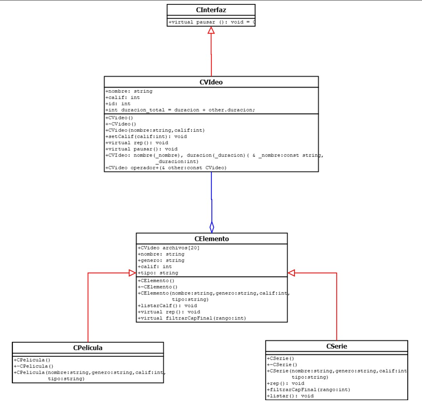

# Streaming Platform Simulation

This repository contains a console-based simulation of a video-on-demand Streaming Platform built using Object-Oriented Programming (OOP) principles in C++. 

## Overview

In recent years, video-on-demand streaming services, such as Netflix, Disney, and DC, have proliferated. This project aims to model a simplified version of such a service, focusing on two types of videos: movies and series. 

### Key Features

- Each video has an ID, a name, a duration, and a genre (drama, action, mystery).
- Series consist of episodes, with each episode having a title and a corresponding season.
- The average rating for each video is calculated on a scale from 0 to 100, where 100 represents the best rating.

### Functionality

The system is designed to:
- Display all videos along with their ratings.
- Show the episodes of a specific series and their ratings.
- Present movies and their ratings.

### Class Diagram

Here is the class diagram that illustrates the structure of the project:

This project serves as a foundation for understanding how a streaming service manages data and processes internally using OOP principles.
